# Microfluidic-Chip-Simulation

+ Course project for Tsinghua 2018 Summer Semester Course : Programming and Training
+ Developed in one week using Qt creator ( first attempt to use Qt )
+ Dependency can be found in .pro
+ User-friendly design

# 第一周大作业设计报告

### 一、     实现的主要功能

1. 主界面可以选择不同的管道列数，弹出窗口输入对应管道的列数以及可以对于列数做进一步修改，其中弹出的对话窗口我自己手动写了一个类似于validator的功能，如果输入错误的话字体会变为红色，点击确认的话会弹出窗口提示。

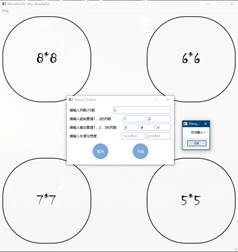    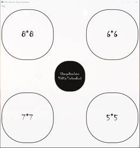

2. 在主界面中间的按钮可以用来切换分辨率（Surface的分辨率和1080p的显示屏效果会有较大差别），切换窗口大小会拥有更好的绘制体验

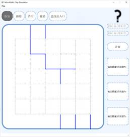      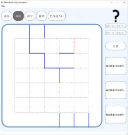

3. 对于界面和绘制界面进行美化，同时绘制体验良好，在移动鼠标的时候可以看到有灰色/红色的线用于预览管道，个人认为体验非常良好，心情非常愉悦。

4. 绘制体验良好：按住alt的键可以切换绘制/擦除，绘制体验类似于Adobe Lightroom的蒙版，此外清空的快捷键的ctrl+c，同时还可以支持撤销功能，撤销的功能当然是ctrl+z，同时支持更改出入口，当鼠标移动到黑色的问号的上面的时候可以看到一个悬浮的帮助(虽然图中的？里面现在什么都没有)

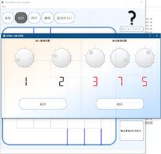  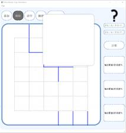

5. 输入管道流速后计算后对于色彩做了渐变映射，效果良好

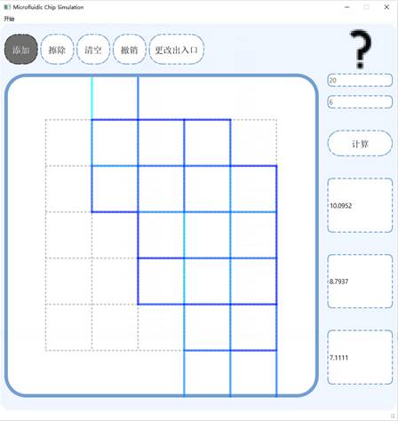

6. 对于内存做了优化，内存占用保持稳定。在这个程序刚写出来的时候会出现内存不断飙升的情况，在进行不断优化之后，切换界面的时候删除不必要的指针，最终实现内存占用稳定（程序最后的可能比较吃CPU），鉴于相应鼠标事件的地方太多可能这个也不太好解决）

7. 自定义tooltip，在鼠标悬浮在？上空会出现提示，由于时间所限没有制作所有按钮的tooltip。

### 二、     程序设计

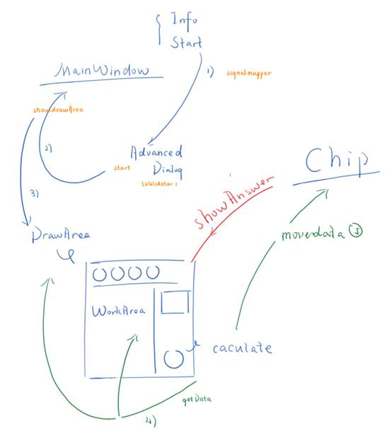

​       上图可能不全。

​       

手绘了一张一个各个窗口之间的关系，程序最底层的部分是Mainwindow，里面有两个界面，其中一个start是开始界面，另外一个info是信息界面（没有添加什么东西），还有一，在start界面点击之后会弹出来一个Advance_Dialog,也就是对于开始列数做初始化的界面，在advanced_dialog中可以实时监测输入内容，也就是将LineEdit与检验的槽连接到一起。点击确认键并检测无误之后会将信号成功的信号发送给MainWindow并新建一个DrawArea，也就是绘图的窗口（命名可能有一些问题）。

​       DrawArea应该算是这个程序的核心窗口，接口如图

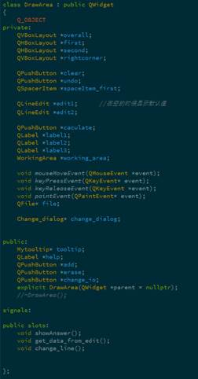 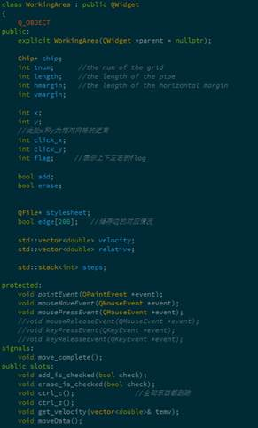

​       程序重写了mouseMoveEvent（用于检测是否有鼠标进入？区域并出现自定义的tooltip），keypressevent和keyreleaseevent的重写用于对于快捷键的使用并激发对应的按钮。重置paintevent适用于自定义样式表。

​       

​       Workingarea用于是绘图区域,重置mouseMoveEvent，mousePressEvent,用于检测对应的鼠标位置以及点击位置以实现预览和绘图功能，通过一个简单的算法实现了预览的边还有 实际画图的效果

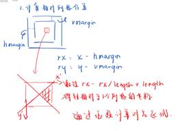

​       

​       通过一个简单的图再进行一下说明。

​       点击之后会根据此时是添加还是删除的状态进行边的添加/删除，通过调用update实现实时更新。Workingarea存了一个stack<int>,每次添加，都会存一个int进去，点击ctrl+z与ctrl_z的槽连接起来实现撤销。此外还有一个切换出入口，会弹出一个窗口（change_dialog类）实现更改。

​       点击calculate键之后会通过槽将数据发送给working_area的chip进行计算。

​       我对于chip的算法做了一点点修改，将里面的200对应换成了流速，扩展了接口，接口多了两个数值。

vector<double> Chip::caluconspeed(int num, vector<double> &length, int i1, int i2, int o1, int o2, int o3,double v1,double v2)

​       当计算完成之后会发送success()信号以及velocity（vector<double>），与workingArea的槽函数连接。

void WorkingArea::get_velocity(vector<double> &temv)；

​       这样workingArea会计算得到数值，以及计算一个相对于最大流速的一个相对值，这样在通过paintevent中通过一个简单的rgb函数完成色彩映射。Workingarea将计算得到的数值存放到了两个vector中，序号是对应的。

​       

​       此外写完程序之后我还做了一个自定义的浮动窗口，也就是tooltip，当鼠标移动到DrawArea界面上的那个问号的时候，就可以出现一个浮动窗口，具体实现是通过在mousemoveevent里面计算了当鼠标移动到？上面的时候，会出现浮动窗口，并且浮动窗口会跟随鼠标移动，有良好的交互效果。

 

### 三、     存在的问题以及反思

1. 我一开始一根筋地自己手动写各个类，这样效率我觉得比较低，最后的时候我用了一下qtdesigner设计了一下change_dialog,我觉得还挺方便，可能某些动态的场景比如workingarea用这个没什么用。（Qtdesigner使用样式表的时候也可以实时看到效果），我觉得在设计ui的时候这样效率会很高，自己一开始摸索设计ui的时候浪费了不少时间

2. 内存管理，在切换页面的时候需要将该删掉的指针都删掉，并且在指针删除之后要将指针设置为nullptr，这样在做删除判断的时候可以使用if语句判断是否为空指针，就可以避免错误了

3. 我有时在类内函数是否设置为private做过纠结，一方面如果设置为public访问会比较方便，一方面似乎设置为public不太符合安全性原则，但是对于这样的一个程序似乎也没有太多安全性问题需要考虑，因此有些地方我选择了设置为公有成员，有些地方我将数据通过信号发送

4. 在信号接受的时候sender（）有时是个很有用的东西，包括通过parentWidget（）获得父窗口的指针也比较好用。

5. 在使用connect的时候需要发送方和接收方都要初始化完毕。

举例来说，我的Mainwindow里面有一个advanced_dialog（在选择列数的时候会弹出的窗口），在mainwindow的构造函数里面我不能将advanced里的按钮进行connect，因为我的advanceddialog是在之后才进行初始化的。

​       